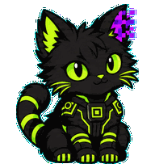

# Open Agent Companion

<p align="center">
  <strong>A tiny, local desktop companion for agents, CLIs, and humans.</strong><br>
  Animated pets, useful reminders, and a deliberately boring JSONL protocol.
</p>

<p align="center">
  
</p>

<p align="center">
  <a href="LICENSE">MIT License</a> ·
  <a href="SPEC.md">Protocol</a> ·
  <a href="SECURITY.md">Security</a>
</p>

**Open Agent Companion 1.0.0 (MIT).** A local, open desktop companion for
agents and CLIs. Any agent or local process publishes state and short
messages through a versioned JSONL protocol; the companion renders them in
a transparent animated window.

No AI, no cloud, no accounts. Reminders, timers, recurrence, pomodoro, and
adapters are producers only: when due, they write a normal `say` event to
the companion inbox through the same canonical pipeline.

## What you get

- Animated PNG/GIF pets driven by a small, inspectable JSONL event protocol.
- A compact right-click GUI for state, position, opacity, messages, and packs.
- Local reminders, timers, recurrence, snooze, and Pomodoro helpers.
- Optional localhost WebSocket and TypeScript integrations.
- Declarative packs, so anyone can bring their own art and personality.

## Contents

- [Quick start](#quick-start)
- [Companion Hub (M11)](#companion-hub-m11)
- [Packs and configuration](#packs-and-configuration)
- [Adapters](#adapters)
- [Operating modes](#operating-modes)
- [Distribution and hardening](#distribution-and-hardening)

## Quick start

```powershell
py -m pip install --editable .
companion --root .companion init
companion --root .companion summon
companion --root .companion --agent terra say "Milestone terminado" --ttl 8
companion --root .companion run --once
companion --root .companion status
```

Messages can use a TTL and integer priority. Higher priority messages are
shown first; queued message TTL starts when that message is displayed:

```powershell
companion --root .companion say "Build urgente" --ttl 8 --priority 10
```

Runtime state persists the pending message queue in the companion's state file.
Queued messages keep their priority and FIFO sequence across Runtime restarts,
and their TTL begins only when they become visible. Active messages retain their
existing absolute expiry. Older state files without the queue field continue to
load with an empty pending queue.

Create and manage local reminders, timers, recurrence, and snooze:

```powershell
companion --root .companion remind add --at "19:30" --message "Sacar la ropa"
companion --root .companion remind add --in 10m --message "Revisar el horno"
companion --root .companion remind add --at "08:00" --message "Stand up" --recurrence daily
companion --root .companion remind add --at "09:00" --message "Reporte" --recurrence weekly --weekdays mon,fri
companion --root .companion timer --in 5m --message "Té listo"
companion --root .companion remind snooze rem_... --minutes 15
companion --root .companion remind list
companion --root .companion remind cancel rem_...
companion --root .companion pomodoro --work 25 --break 5 --message "Deep work"
companion --root .companion notify "Build terminado"
```

`--at` accepts local `HH:MM` or an ISO-8601 timestamp. `--in` accepts
`30s`, `10m`, `2h`, or `1d`. Stored records retain their explicit UTC
offset in `reminders.json`. `companion run` checks due reminders and
processes their events; an overdue pending reminder fires once after
restart. Recurring reminders fire and reschedule: `daily` is +1 day,
`weekly` is +7 days (or the next matching `--weekdays`), and `countdown`
ticks `message` as `N..1` each minute. Snoozed reminders wait until
`snoozed_until` before becoming pending again. Pomodoro only plans two
one-shot reminders through the same pipeline; it is not a runtime feature.
`notify` is an optional best-effort OS notification (`pip install
'open-agent-companion[notify]'`); it never blocks the pipeline.

## Companion Hub (M11)

Companion Hub is the local, consumer-facing launcher for creating and managing
visual desktop companions. It discovers installed packs, keeps a small local
collection, and gives each created companion its own runtime root so pets do
not share state files.

Launch it from an editable/source install with either command:

```powershell
companion hub
companion-hub
```

Use explicit local paths when you want a portable collection or a different
pack folder (paths containing spaces are supported):

```powershell
companion hub --hub-root "D:\Companion Hub data" --packs-dir ".\packs"
```

On first run, choose **Create my companion** to select a valid local pack and
give the visual companion a name, or **Open my collection** to browse the
local pet collection. The selected companion can be started, shown, hidden,
or stopped. Hub records only the processes it starts in the current session;
it never stops a pet launched outside that session or one from an earlier Hub
session.

Hub data belongs to the current local user. By default it lives under the
platform Companion data directory in `hub`; `--hub-root` overrides that
location. The Hub registry is `companions.json`, and every companion receives
an independent `<hub-root>/runtimes/<id>` directory. Hub reads local pack
manifests and does not modify them.

M11 creates local visual companions only. Companion Forge, capability Doctor,
agent detection, recipes, installation, and configuration execution begin in
M12. Hub makes no network requests and does not install agents.

### Windows executables

Install the optional build tooling once, then build the local PyInstaller
artifacts without a network step:

```powershell
py -m pip install --editable ".[build]"
powershell -NoProfile -ExecutionPolicy Bypass -File tools\build_exe.ps1 -Target hub
```

This produces `dist\companion.exe` for the existing runtime/CLI and
`dist\Companion Hub.exe` for the desktop launcher. Keep both executables
together: the Hub starts its sibling `companion.exe` for Hub-owned pets.
`-Target cli` builds only the CLI/runtime artifact; `-Target all` builds both.

## Packs and configuration

A pack is a folder with a declarative `manifest.json`:

```json
{
  "id": "example-cat",
  "name": "Example Cat",
  "animations": {
    "idle": "idle.gif",
    "thinking": "think.gif",
    "success": "success.gif",
    "error": "error.gif"
  }
}
```

Validate it before use:

```powershell
companion pack validate .\assets\example-cat
companion --root .companion gui --pack .\assets\example-cat
```

The included Malbolgato pack and renderer request are a complete smoke test:

```powershell
companion pack validate .\packs\malbolge-cat
companion render-request validate .\examples\render_request.json
companion --root .companion gui --pack .\packs\malbolge-cat
```

examples/render_request.json is a renderer-facing customization contract.
name and style are required; palette, states, output.cell_size, and
renderer-specific fields are optional. Companion validates the supported
fields and prints normalized JSON; it does not render or make network calls.
Missing optional animation states fall back to idle. A missing asset or an
invalid manifest is reported by pack validate before the GUI opens.

The renderer chooses a mood-specific asset first, then the current state, then
`idle`. Missing optional states therefore do not break a pack. Configuration
can select the pack and window settings:

```toml
[companion]
name = "Terra"
pack = "assets/example-cat"

[window]
position = "bottom-right"
topmost = true
opacity = 1.0
```

Launch the GUI from a configuration file when you want the same setup every
time:

```powershell
companion --root .companion gui --config .\companion.toml
```

The `pack` value is resolved relative to the directory containing
`companion.toml`, not relative to the current shell directory. For example,
with the file above saved at the project root, `pack = "packs/malbolge-cat"`
loads `./packs/malbolge-cat` even if the command is launched from elsewhere.

Launch the desktop window with an optional GIF or PNG:

```powershell
companion --root .companion gui --asset .\assets\example-cat\idle.gif --name Terra
```

Click and drag the window to move it. Press `Esc` to close it.
Right-click the mascot for compact controls: state, position, opacity, message
visibility, pack selection, and pack reload. The controls update the local
runtime and never modify pack files. If the mascot appears stuck on idle,
check the pack path and run pack validate again.

Any process can publish directly by appending one JSON object per line to
`.companion/inbox.jsonl`. See [SPEC.md](SPEC.md) for the contract and
[ROADMAP.md](ROADMAP.md) for the current milestones.

## Adapters

Adapters translate external events into companion JSONL events. They are
isolated from the core protocol — the companion never calls external APIs.

### Generic hook adapter

Pipe canonical JSONL events from any process into the companion:

```powershell
# Direct publish
echo {"version":"companion-event-v1","id":"x","agent":"hook","created_at":"2026-09-09T00:00:00Z","type":"say","text":"Hello"} | companion hook

# From a script
companion --root .companion hook < events.jsonl
```

Each input line must be a complete JSON event. Invalid lines are reported
as errors without stopping the runtime.

### WebSocket adapter (optional)

Start a localhost-only WebSocket server on `127.0.0.1:8765`:

```powershell
companion websocket --port 8765
```

Requires `pip install 'open-agent-companion[websocket]'`. Only loopback
hosts are permitted — no remote connections.

### OpenCode integration

The TypeScript plugin translates OpenCode session events into companion state
changes. It writes to the same `inbox.jsonl` format.

**OpenCode plugin** (for published OpenCode):

```typescript
import { CompanionPlugin } from "companion/integrations/opencode-plugin"

export default {
  name: "companion",
  plugins: [CompanionPlugin],
}
```

The plugin emits `state` and `say` events on `session.idle`, `session.error`,
and `question.asked`. The companion shows a message and updates its state
automatically — no AI, no cloud, no accounts.

## Operating modes

The desktop companion has three independent modes:

1. Standalone: an autonomous desktop creature.
2. Manual/local utility: GUI, CLI, and local reminders.
3. External control: Bridge, agents, or other local processes.

None is privileged. AI, Bridge, and the scheduler are optional. The runtime
remains the common visual substrate.

## Multiple companions

Run multiple independent companions sharing the same inbox directory:

```powershell
# Terminal 1: companion alpha
companion --root .companion --companion-id alpha gui

# Terminal 2: companion beta
companion --root .companion --companion-id beta gui

# Send to specific companion
companion --root .companion say "Hola alpha" --companion-id alpha

# Send to all companions (no --companion-id)
companion --root .companion say "Broadcast"
```

Each companion maintains its own state file (`state-{id}.json`), messages,
and reminders. Events without `companion_id` are visible to all companions.
Events with `companion_id` are routed only to that companion.

## Distribution and hardening

```powershell
companion --version
companion path
companion doctor
companion logs --tail 20
```

- Data dir: explicit `--root` wins, then `$COMPANION_ROOT`, then `./.companion`.
  `companion path` also shows the platform default dir and discovered
  `companion.toml/json`.
- Crash recovery: state, reminders, and inbox offsets are written atomically
  (`fsync` + tmp + replace). Corrupt JSON is backed up to `*.corrupt` and the
  runtime keeps going with defaults; `doctor` reports the backups.
- Logs: structured JSONL in `<root>/logs.jsonl`, warnings/errors also on stderr.
- Cross-platform: Windows uses `-transparentcolor`, Linux/macOS fall back to
  `-alpha`. No code path assumes backslashes or drive letters.
- Build: `powershell -ExecutionPolicy Bypass -File tools\build_exe.ps1`
  produces `dist\companion.exe` (PyInstaller, local only).
- Security: no shell execution, no network by default, WebSocket is opt-in
  localhost-only. See [SECURITY.md](SECURITY.md).
