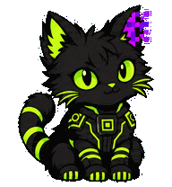
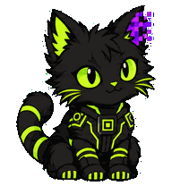
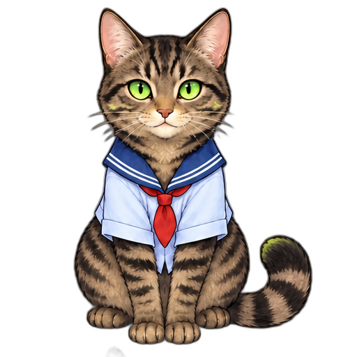

<div align="center">



# Open Agent Companion

### Mascotas de escritorio que reaccionan a tus herramientas locales

[](https://github.com/DannyBaanks/Companion/actions/workflows/ci.yml)
[](https://www.python.org/)
[](./LICENSE)

</div>

<p align="center">
  
  
</p>

**Open Agent Companion** pone una mascotita animada en tu escritorio. Puede
mostrar estados, mensajes y recordatorios; también puede reaccionar a eventos
de una CLI o de una integración local que tú conectes.

La mascota acompaña lo que haces. No es un chatbot ni un agente: no decide ni
ejecuta tareas.

---

## 🚀 Empieza en tres pasos

Necesitas **Python 3.11 o posterior**. En Linux, si Python no encuentra Tk,
instala también el paquete `python3-tk` de tu distribución.

**1. Descarga el proyecto e instala Companion:**

```bash
git clone https://github.com/DannyBaanks/Companion.git
cd Companion
python -m pip install --editable .
```

En Windows puedes usar `py` en lugar de `python`.

**2. Inicializa tus datos y abre a Malbolgato:**

```bash
companion --root .companion init
companion --root .companion gui --pack packs/malbolge-cat --name Malbolgato
```

La ventana se puede arrastrar. Presiona `Esc` para cerrarla y haz clic derecho
sobre la mascota para abrir sus controles.

**3. Mándale un mensaje desde otra terminal:**

```bash
companion --root .companion say "Ya llegué :p" --ttl 8
```

También puedes cambiar su estado:

```bash
companion --root .companion mood thinking
```

---

## 🐾 ¿Qué puede hacer?

| Quieres… | Companion puede… |
|---|---|
| Ver si una herramienta está trabajando | Cambiar entre estados como `thinking`, `working`, `success`, `error` y `waiting`. |
| Darle personalidad visual | Mostrar packs PNG o GIF, temas y frases locales configurables. |
| Acordarte de algo | Crear recordatorios, timers, recurrencias, snooze y ciclos Pomodoro. |
| Tener más de una mascota | Mantener estado independiente para cada Companion. |
| Conectarlo a tus herramientas | Recibir eventos mediante una CLI, un hook JSONL o integraciones opcionales. |
| Revisar si algo anda mal | Consultar diagnósticos locales y logs estructurados. |

## 🎨 Elige tu pack

Cada pack es una carpeta con un `manifest.json` y sus imágenes. Puedes crear
uno propio y validarlo antes de abrirlo:

```bash
companion pack validate ./packs/mi-gato
companion --root .companion gui --pack ./packs/mi-gato --name "Mi Gato"
```

Packs incluidos:

| Pack | Estilo |
|---|---|
| [`malbolge-cat`](./packs/malbolge-cat/) | Gato pixel-art neón con animaciones GIF. |
| [`tabby-shinji-cat`](./packs/tabby-shinji-cat/) | Gato tabby con ilustraciones estilo anime. |
| [`example-cat`](./examples/example-cat/) | Pack mínimo para experimentar. |

Si falta una animación opcional, se usa `idle`. Los packs solo describen cómo
se ve la mascota; no pueden ejecutar acciones.

## ⏰ Recordatorios y timers

```bash
companion --root .companion remind add --in 10m --message "Tomar agua"
companion --root .companion remind list
companion --root .companion remind snooze rem_ID --minutes 15
companion --root .companion timer --in 5m --message "Revisar el horno"
companion --root .companion pomodoro --work 25 --break 5 --message "Foco"
```

Los mensajes se guardan como datos. Companion no los interpreta como comandos
ni los ejecuta en una terminal.

## 🏠 Companion Hub

Si usas varias mascotas, abre el Hub:

```bash
companion --root .companion hub --theme soft-neon
```

Desde ahí puedes crear instancias y mostrar, ocultar, iniciar o detener las
que administra el Hub. Los temas incluidos son `dark`, `light` y `soft-neon`.

## 🔌 Conecta una herramienta local

Companion puede recibir eventos de estas formas:

- **Hook JSONL:** `companion hook` acepta eventos canónicos desde la entrada estándar.
- **WebSocket opcional:** requiere instalar `open-agent-companion[websocket]` y solo escucha en localhost.
- **OpenCode y OpenISy TUI:** plugins incluidos en [`integrations/`](./integrations/).

Las integraciones hacen que la mascota muestre estados y mensajes. No le dan
autoridad para ejecutar lo que diga un evento.

## 🔒 Local y bajo tu control

- No necesita cuenta, servicio en la nube ni modelo de IA.
- No abre conexiones de red por defecto.
- El texto de mensajes y recordatorios no se ejecuta como código.
- El WebSocket es opcional y limitado a localhost.
- Los estados se guardan en tu equipo; los datos dañados se respaldan para diagnóstico.

Lee [Privacidad y seguridad](./SECURITY.md) para conocer los límites y las
garantías del proyecto.

---

## 🆘 Si algo no funciona

| Pasa esto | Prueba esto |
|---|---|
| No aparece la mascota | Confirma que Python tenga Tk instalado y que el pack pase `companion pack validate`. |
| La mascota no recibe el mensaje | Revisa que la ventana y el comando usen el mismo `--root`. |
| No recuerdas dónde guarda los datos | Ejecuta `companion --root .companion path`. |
| El diagnóstico encuentra problemas | Ejecuta `companion --root .companion doctor` y revisa cada aviso. |

La [guía en español](./GUIA.md) tiene ejemplos de comandos, recordatorios,
packs, Hub y solución de problemas.

<details>
<summary><b>⌨️ Más comandos</b></summary>

```bash
# Revisar el estado y el diagnóstico
companion --root .companion status
companion --root .companion doctor --json

# Consultar logs recientes
companion --root .companion logs --tail 20

# Procesar una vez los eventos y recordatorios pendientes
companion --root .companion run --once

# Mostrar una notificación del sistema (requiere el extra opcional)
python -m pip install --editable '.[notify]'
companion --root .companion notify "Hola"
```

</details>

<details>
<summary><b>Para desarrolladores: protocolo y pruebas</b></summary>

Companion usa el protocolo versionado `companion-event-v1`: los productores
agregan eventos JSONL al inbox local y el runtime los procesa en orden. El
contrato completo está en [`SPEC.md`](./SPEC.md).

```bash
python -m pip install --editable '.[test]'
python -m pytest -q
python examples/demo_e2e.py
```

GitHub Actions ejecuta las pruebas y el demo en Linux, Windows y macOS con
Python 3.11, 3.12 y 3.13; después construye el paquete.

Consulta [`CONTRIBUTING.md`](./CONTRIBUTING.md) para contribuir y
[`ROADMAP.md`](./ROADMAP.md) para ver el rumbo del proyecto.

</details>

## Licencia

El proyecto usa la [licencia MIT](./LICENSE).

